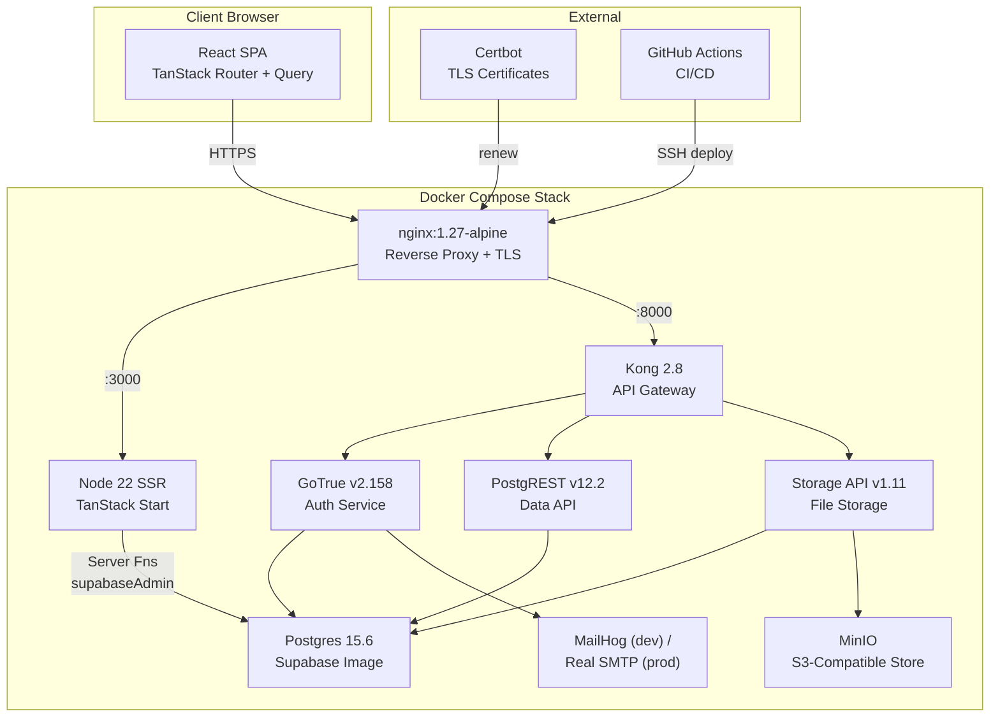
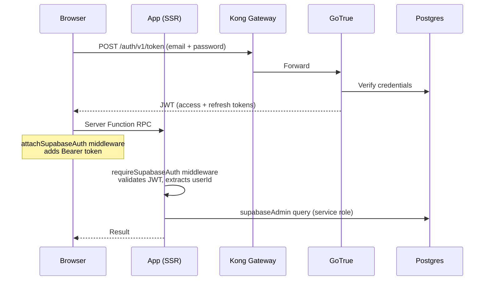

# Nolte Küchen ERP — Full Project Audit Report

> **Date**: 2026-08-03  
> **Scope**: Complete codebase, infrastructure, database, CI/CD, and security posture  
> **Verdict**: A well-engineered, production-grade internal ERP with strong DevOps foundations and thoughtful security layers. The main weaknesses are in frontend architecture (oversized route files), incomplete client-side permission enforcement, and a few infrastructure hardening gaps.

---

## Table of Contents
1. [Executive Summary](#1-executive-summary)
2. [Architecture Overview](#2-architecture-overview)
3. [Tech Stack & Dependencies](#3-tech-stack--dependencies)
4. [Project Structure & Organization](#4-project-structure--organization)
5. [Frontend Analysis](#5-frontend-analysis)
6. [Backend & Server Functions](#6-backend--server-functions)
7. [Database & Migrations](#7-database--migrations)
8. [Authentication & Authorization](#8-authentication--authorization)
9. [Infrastructure & DevOps](#9-infrastructure--devops)
10. [Security Posture](#10-security-posture)
11. [Code Quality & Patterns](#11-code-quality--patterns)
12. [Issues by Severity](#12-issues-by-severity)
13. [Recommendations](#13-recommendations)

---

## 1. Executive Summary

**Nolte Küchen** is an internal ERP system for a kitchen company, handling products, stock, sales, orders, invoices, appointments, customers, suppliers, documents, and user management. The app is bilingual (French/Arabic with RTL support).

### Strengths
- **Mature self-hosting stack**: Full Supabase self-hosted with Docker Compose, well-documented and battle-tested
- **Strong privilege model documentation**: [CLAUDE.md](file:///c:/Users/USER/Desktop/nolte%20v1.0/noltekuchen/CLAUDE.md) contains hard-won operational knowledge
- **Defense in depth**: RLS + server-side admin checks + nginx rate limiting + fail2ban + UFW
- **Proper migration system**: Ordered, tracked, idempotent migrations with dependency gating
- **Comprehensive audit logging**: Both client-side and server-side audit trails
- **Good error handling**: Custom SSR error recovery, branded error pages, toast notifications

### Key Weaknesses
- **Monolithic route files**: 5 route files exceed 30KB (up to 37KB / 770 lines each) — "God components"
- **No automated tests**: Zero test files in the entire project
- **Client-side permission checks only**: Most data access relies on RLS, but UI permission gates can be bypassed
- **`any` types in server functions**: Weakens TypeScript's safety net in critical auth paths
- **No container resource limits** in dev compose; only `app` has a memory limit in prod

---

## 2. Architecture Overview



### Data Flow
1. **Browser → nginx** (TLS-terminated) → **App container** (SSR + serverFn RPCs)
2. **Browser → nginx → Kong** (API gateway) → **PostgREST / GoTrue / Storage**
3. **Server functions** use `supabaseAdmin` (service role, bypasses RLS) for admin operations
4. **Client Supabase SDK** uses anon key + user JWT (RLS applies)

---

## 3. Tech Stack & Dependencies

### Core Stack

| Layer | Technology | Version |
|-------|-----------|---------|
| **Language** | TypeScript | ^5.8.3 |
| **UI Framework** | React | ^19.2.0 |
| **Router** | TanStack Router | ^1.170.16 |
| **SSR Framework** | TanStack Start | ^1.168.26 |
| **State/Data** | TanStack React Query | ^5.83.0 |
| **Styling** | Tailwind CSS v4 | ^4.2.1 |
| **UI Components** | shadcn/ui (Radix) | 45+ primitives |
| **Animation** | Framer Motion | ^12.38.0 |
| **Backend** | Supabase (self-hosted) | Multiple services |
| **Database** | PostgreSQL | 15.6 |
| **Build Tool** | Vite | ^7.3.1 |
| **Package Manager** | Bun (lockfile) | — |
| **Runtime** | Node.js 22 | Alpine image |
| **API Gateway** | Kong | 2.8 |

### Notable Dependencies

| Package | Purpose | Notes |
|---------|---------|-------|
| `jspdf` + `jspdf-autotable` | Invoice PDF generation | Client-side PDF rendering |
| `pdfjs-dist` | PDF viewing | For document management module |
| `xlsx` | Excel export | Loaded from CDN tarball (⚠️ see findings) |
| `recharts` | Dashboard charts | Area/bar charts |
| `zod` | Schema validation | Listed but appears underutilized |
| `sonner` | Toast notifications | Used consistently |
| `date-fns` | Date formatting | Lightweight |
| `cmdk` | Command palette | shadcn command component |

### Dependency Observations

> [!WARNING]
> **xlsx package loaded from CDN tarball**: [package.json:73](file:///c:/Users/USER/Desktop/nolte%20v1.0/noltekuchen/package.json#L73) installs `xlsx` from `https://cdn.sheetjs.com/xlsx-0.20.3/xlsx-0.20.3.tgz` — this bypasses npm's registry integrity checks and depends on an external CDN's availability and integrity.

> [!NOTE]
> **nitro `3.0.260603-beta`**: [package.json:59](file:///c:/Users/USER/Desktop/nolte%20v1.0/noltekuchen/package.json#L59) pins a beta version of Nitro. While TanStack Start has since moved away from Nitro, this dependency remains.

---

## 4. Project Structure & Organization

```
noltekuchen/
├── src/
│   ├── routes/           # 30 TanStack file routes (pages)
│   ├── components/
│   │   ├── ui/           # 45 shadcn/Radix primitives
│   │   └── data/         # 9 shared data display components
│   ├── lib/              # 14 utility/service modules
│   ├── hooks/            # 1 hook (use-mobile)
│   ├── integrations/
│   │   └── supabase/     # 5 files: client, server, auth, types
│   ├── assets/           # Static images
│   ├── server.ts         # SSR entry with error recovery
│   ├── start.ts          # TanStack Start config + middleware
│   ├── router.tsx         # Router + QueryClient setup
│   ├── styles.css        # Global Tailwind + custom tokens
│   └── routeTree.gen.ts  # Auto-generated route tree
├── backend/
│   └── volumes/
│       ├── api/kong.yml  # Kong declarative config
│       └── db/
│           ├── init/     # 00-roles.sh (first-boot DB setup)
│           └── run-app-migrations.sh
├── database/
│   └── migrations/       # 34 ordered SQL migrations
├── frontend/
│   ├── Dockerfile        # Multi-stage Node 22 build
│   ├── serve.mjs         # Custom Node HTTP server
│   ├── server-node.ts    # Node SSR entry override
│   └── vite.config.node.ts
├── nginx/
│   ├── nginx.conf        # Main config + rate limiting
│   └── conf.d/
│       ├── app.conf.template  # Templated vhost config
│       └── security-headers.conf
├── scripts/              # 12 operational bash scripts
├── monitoring/           # Prometheus + Grafana + Promtail
├── docker-compose.yml    # Dev stack (10 services)
├── docker-compose.prod.yml  # Prod overlay
├── docker-compose.monitoring.yml
└── docs/design/          # Design documentation
```

### Organization Assessment

| Aspect | Rating | Notes |
|--------|--------|-------|
| **Separation of concerns** | ⚠️ Fair | Routes are monolithic; lib/ is well-organized |
| **Component reuse** | ✅ Good | 45 shadcn primitives + 9 shared data components |
| **Server/client boundary** | ✅ Good | `.functions.ts` suffix convention; `client.server.ts` clearly separated |
| **Documentation** | ✅ Excellent | CLAUDE.md, DEPLOY.md, MIGRATION.md, inline comments |
| **Config management** | ✅ Good | `.env.example` is thorough and well-commented |

---

## 5. Frontend Analysis

### Route File Sizes — The "God Component" Problem

> [!CAUTION]
> **Five route files exceed 30KB each.** These are monolithic single-file components containing queries, mutations, state, forms, dialogs, tables, and business logic all in one file.

| File | Lines | Size | Concern Level |
|------|-------|------|---------------|
| [_app.orders.index.tsx](file:///c:/Users/USER/Desktop/nolte%20v1.0/noltekuchen/src/routes/_app.orders.index.tsx) | 688 | 37KB | 🔴 Critical |
| [_app.sales.index.tsx](file:///c:/Users/USER/Desktop/nolte%20v1.0/noltekuchen/src/routes/_app.sales.index.tsx) | ~680 | 34KB | 🔴 Critical |
| [_app.appointments.tsx](file:///c:/Users/USER/Desktop/nolte%20v1.0/noltekuchen/src/routes/_app.appointments.tsx) | ~670 | 33KB | 🔴 Critical |
| [_app.products.index.tsx](file:///c:/Users/USER/Desktop/nolte%20v1.0/noltekuchen/src/routes/_app.products.index.tsx) | 770 | 32KB | 🔴 Critical |
| [_app.invoices.index.tsx](file:///c:/Users/USER/Desktop/nolte%20v1.0/noltekuchen/src/routes/_app.invoices.index.tsx) | ~640 | 32KB | 🔴 Critical |

**Impact**: Difficult to maintain, hard to test in isolation, poor code review experience, potential re-render performance issues.

### State Management

- **React Query** used consistently for server state with good defaults:
  - `staleTime: 60_000` (1 minute) — [router.tsx:9](file:///c:/Users/USER/Desktop/nolte%20v1.0/noltekuchen/src/router.tsx#L9)
  - `refetchOnWindowFocus: false` — appropriate for internal tool
  - `retry: 1` — sensible for ERP
- **Local state** managed via `useState` — no unnecessary complexity
- **No global client state library** (Redux, Zustand) — correctly avoids over-engineering

### Shared Data Components

A well-designed shared data component layer in [src/components/data/](file:///c:/Users/USER/Desktop/nolte%20v1.0/noltekuchen/src/components/data):

| Component | Purpose |
|-----------|---------|
| `pagination.tsx` | Generic pagination with `usePagination` hook |
| `table-shell.tsx` | Consistent table wrapper with state rows |
| `table-skeleton.tsx` | Loading skeleton for tables |
| `empty-state.tsx` | No-data placeholder |
| `error-state.tsx` | Error display with retry |
| `stat-card.tsx` | Dashboard KPI cards |
| `status-badge.tsx` | Themed status badges |
| `toolbar.tsx` | Search + filter bar |
| `page-header.tsx` | Page title component |

### i18n Implementation

The [i18n module](file:///c:/Users/USER/Desktop/nolte%20v1.0/noltekuchen/src/lib/i18n.tsx) is a custom, lightweight implementation:

- **Languages**: French (primary) + Arabic (RTL)
- **Approach**: Static dictionaries in a single file (130+ keys each)
- **RTL handling**: Sets `document.documentElement.dir` on language change
- **SSR safety**: Guards against `window`/`document` on server

> [!NOTE]
> Many UI strings are **hardcoded in French** outside the i18n system (e.g., status labels like `"En attente"`, `"Validée"`, form labels, error messages in server functions). The Arabic dictionary covers nav and common labels but not domain-specific terms.

### PDF Generation

[invoice-pdf.ts](file:///c:/Users/USER/Desktop/nolte%20v1.0/noltekuchen/src/lib/invoice-pdf.ts) (507 lines) generates professional invoices client-side:

- Uses `jsPDF` + `jspdf-autotable`
- Custom brand color palette aligned with CSS tokens
- `pdfText` sanitizer strips non-WinAnsi characters
- Moroccan legal information (ICE, RC, IF) hardcoded — appropriate for single-entity ERP
- Well-structured with clear separation of layout concerns

### Money Calculations

[money.ts](file:///c:/Users/USER/Desktop/nolte%20v1.0/noltekuchen/src/lib/money.ts) implements careful rounding:

- `round2()` uses `Number.EPSILON` trick for consistent penny rounding
- `computeTotals()` sums pre-rounded line items (matches database `numeric(12,2)`)
- Documents the prior bug (sum-of-unrounded vs sum-of-rounded) in comments

---

## 6. Backend & Server Functions

### Server Function Pattern

Server functions use TanStack Start's `createServerFn` with a consistent pattern:

```
createServerFn({ method })
  .middleware([requireSupabaseAuth])  ← JWT validation
  .inputValidator(...)               ← Type-level validation (weak)
  .handler(async ({ data, context }) => {
    await assertAdmin(context.supabase, context.userId);  ← Role check
    const { supabaseAdmin } = await import("...");        ← Dynamic import
    // ... business logic with supabaseAdmin (bypasses RLS)
  })
```

### Server-Side Files

| File | Purpose | Lines |
|------|---------|-------|
| [users.functions.ts](file:///c:/Users/USER/Desktop/nolte%20v1.0/noltekuchen/src/lib/users.functions.ts) | User CRUD, role assignment, password reset | 180 |
| [roles.functions.ts](file:///c:/Users/USER/Desktop/nolte%20v1.0/noltekuchen/src/lib/roles.functions.ts) | Role + permission management | 139 |
| [auth-middleware.ts](file:///c:/Users/USER/Desktop/nolte%20v1.0/noltekuchen/src/integrations/supabase/auth-middleware.ts) | JWT extraction & verification | 81 |
| [auth-attacher.ts](file:///c:/Users/USER/Desktop/nolte%20v1.0/noltekuchen/src/integrations/supabase/auth-attacher.ts) | Client-side token attachment | 16 |
| [server.ts](file:///c:/Users/USER/Desktop/nolte%20v1.0/noltekuchen/src/server.ts) | SSR error recovery wrapper | 81 |
| [start.ts](file:///c:/Users/USER/Desktop/nolte%20v1.0/noltekuchen/src/start.ts) | Middleware registration | 25 |

### SSR Entry & Error Handling

The [server.ts](file:///c:/Users/USER/Desktop/nolte%20v1.0/noltekuchen/src/server.ts) implements a sophisticated error recovery system:

1. **Global error capture** via [error-capture.ts](file:///c:/Users/USER/Desktop/nolte%20v1.0/noltekuchen/src/lib/error-capture.ts): captures unhandled errors/rejections with a 5-second TTL
2. **h3 swallowed error detection**: `isCatastrophicSsrErrorBody()` detects when h3 converts throws into generic `{message: "HTTPError", unhandled: true}` JSON responses
3. **Branded error page**: Returns a styled HTML error page instead of raw JSON

> [!TIP]
> This is excellent defensive engineering — the comments document exactly why each check exists, including the specific framework behavior that necessitated it.

### Custom Node Server

[serve.mjs](file:///c:/Users/USER/Desktop/nolte%20v1.0/noltekuchen/frontend/serve.mjs) bridges TanStack Start's Web-standard `{ fetch }` handler to a Node HTTP server:

- Path traversal protection in `resolveStaticPath()` — normalizes and validates against `CLIENT_DIR`
- Proper MIME type mapping
- Cache headers: immutable for Vite-fingerprinted assets, 1-hour for others
- Converts Node `IncomingMessage` to Web `Request` and back

---

## 7. Database & Migrations

### Migration System

- **34 migrations** in [database/migrations/](file:///c:/Users/USER/Desktop/nolte%20v1.0/noltekuchen/database/migrations), spanning May–August 2026
- Named `<timestamp>_<uuid>.sql`, applied in filename order
- Tracked in `public._schema_migrations` table
- Applied by [run-app-migrations.sh](file:///c:/Users/USER/Desktop/nolte%20v1.0/noltekuchen/backend/volumes/db/run-app-migrations.sh) with `ON_ERROR_STOP=1`
- **PostgREST schema reload** via `NOTIFY pgrst, 'reload schema'` after migrations

### Schema Overview (from types.ts — 1,999 lines)

| Table | Purpose |
|-------|---------|
| `profiles` | User profiles (FK → auth.users) |
| `user_roles` | Role assignments (enum + role_key) |
| `roles` | Custom role definitions |
| `permissions` | Permission catalog (module × action) |
| `role_permissions` | Role-to-permission mapping |
| `user_permissions` | Per-user permission overrides |
| `products` | Product catalog |
| `categories` | Product categories |
| `suppliers` | Supplier directory |
| `customers` | Customer directory |
| `stock_movements` | Inventory movements |
| `warehouses` | Multi-warehouse support |
| `orders` + `order_items` | Purchase/sale orders |
| `sales` + `sale_items` | Sales records |
| `invoices` + `invoice_items` | Invoice management |
| `documents` + `document_history` | Document management |
| `appointments` | Appointment scheduling |
| `projects` + `project_stages` | Project tracking |
| `purchase_orders` + `purchase_order_items` | Procurement |
| `audit_logs` | Comprehensive audit trail |
| `_schema_migrations` | Migration tracking |

### RLS Policy Model

The project uses a **layered RLS approach** that evolved over migrations:

1. **Early migrations**: Simple `has_role(auth.uid(), 'admin')` checks
2. **Later migrations** ([20260711164236](file:///c:/Users/USER/Desktop/nolte%20v1.0/noltekuchen/database/migrations/20260711164236_450be9a4-b4b1-44ad-91d8-24b84462ee70.sql)): Granular `user_has_permission(uid, module, action)` checks
3. **Critical functions**: `SECURITY DEFINER` with `SET search_path` to prevent privilege escalation

### Database Init ([00-roles.sh](file:///c:/Users/USER/Desktop/nolte%20v1.0/noltekuchen/backend/volumes/db/init/00-roles.sh))

Well-engineered first-boot script that:
- Creates Supabase-required roles (`anon`, `authenticated`, `service_role`, `authenticator`, etc.)
- Uses `.sh` instead of `.sql` to properly pass `POSTGRES_PASSWORD` via psql variables
- Grants role memberships needed by PostgREST and Storage for `SET ROLE`
- Documents the Postgres 15 `PUBLIC` schema changes

---

## 8. Authentication & Authorization

### Auth Flow



### Auth Implementation

- **[AuthProvider](file:///c:/Users/USER/Desktop/nolte%20v1.0/noltekuchen/src/lib/auth.tsx)**: Context-based auth state with `onAuthStateChange` listener
- **[auth-middleware.ts](file:///c:/Users/USER/Desktop/nolte%20v1.0/noltekuchen/src/integrations/supabase/auth-middleware.ts)**: Server-side JWT validation using `supabase.auth.getClaims(token)` — validates token structure and extracts `sub` (user ID)
- **[auth-attacher.ts](file:///c:/Users/USER/Desktop/nolte%20v1.0/noltekuchen/src/integrations/supabase/auth-attacher.ts)**: Client middleware that automatically attaches the Bearer token to all serverFn RPCs
- **Route guard**: [_app.tsx](file:///c:/Users/USER/Desktop/nolte%20v1.0/noltekuchen/src/routes/_app.tsx) redirects to `/login` if not authenticated

### Permission System

**Three layers**:

1. **Database RLS** (Postgres level): Enforced on every query through PostgREST
2. **Server function guards** (`assertAdmin`): Explicit role check before admin operations
3. **Client UI gates** ([permissions.tsx](file:///c:/Users/USER/Desktop/nolte%20v1.0/noltekuchen/src/lib/permissions.tsx)): `usePermissions().can(module, action)` hides/shows UI elements

> [!IMPORTANT]
> **The `assertAdmin` function uses `any` for the Supabase client type** ([roles.functions.ts:6](file:///c:/Users/USER/Desktop/nolte%20v1.0/noltekuchen/src/lib/roles.functions.ts#L6), [users.functions.ts:14](file:///c:/Users/USER/Desktop/nolte%20v1.0/noltekuchen/src/lib/users.functions.ts#L14)). This is duplicated in both files — should be a shared utility with proper typing.

> [!WARNING]
> **Route protection is client-side only** — the `_app.tsx` layout uses a `useEffect` redirect, not a server-side `beforeLoad` guard. An authenticated but unauthorized user could potentially access any route's UI by navigating directly, though data fetches would still be gated by RLS.

---

## 9. Infrastructure & DevOps

### Docker Compose Architecture

**Dev stack** ([docker-compose.yml](file:///c:/Users/USER/Desktop/nolte%20v1.0/noltekuchen/docker-compose.yml)) — 10 services:

| Service | Image | Purpose |
|---------|-------|---------|
| `db` | supabase/postgres:15.6.1.146 | PostgreSQL with Supabase extensions |
| `auth` | supabase/gotrue:v2.158.1 | Authentication (GoTrue) |
| `rest` | postgrest/postgrest:v12.2.3 | REST API (PostgREST) |
| `storage` | supabase/storage-api:v1.11.13 | File storage API |
| `kong` | kong:2.8 | API gateway |
| `minio` | minio/minio:RELEASE.2024-08-17 | S3-compatible object storage |
| `minio-init` | minio/mc | Bucket bootstrap (one-shot) |
| `smtp` | mailhog/mailhog:v1.0.1 | Dev email catcher |
| `db-migrate` | supabase/postgres:15.6.1.146 | Migration runner (one-shot) |
| `app` | Custom Dockerfile | TanStack Start SSR app |

**Prod overlay** ([docker-compose.prod.yml](file:///c:/Users/USER/Desktop/nolte%20v1.0/noltekuchen/docker-compose.prod.yml)) adds:
- `nginx` (reverse proxy + TLS)
- `certbot` (Let's Encrypt auto-renewal)
- Uses `!reset` tag to properly clear dev ports
- `restart: always` on all services
- Log rotation caps (`max-size: 10m`, `max-file: 5`)
- MailHog disabled via `profiles: ["never"]`
- Memory limit on app container (1GB)

### CI/CD Pipeline

[deploy.yml](file:///c:/Users/USER/Desktop/nolte%20v1.0/noltekuchen/.github/workflows/deploy.yml) — Simple SSH-based deployment:

1. Configures SSH key from GitHub secrets
2. SSHes into VPS
3. `git pull --ff-only`
4. Rebuilds app container
5. Runs migrations
6. Restarts app
7. Conditionally re-renders nginx config if `nginx/` files changed
8. Prunes old images

> [!NOTE]
> **No build/lint/test step in CI** — the pipeline goes straight from push to production deploy. This is a significant gap.

### Nginx Configuration

[nginx.conf](file:///c:/Users/USER/Desktop/nolte%20v1.0/noltekuchen/nginx/nginx.conf):
- Rate limiting: `auth_zone` (5 r/s, burst 10), `api_zone` (30 r/s, burst 60)
- `client_max_body_size 55M` (matches Storage's 50MB limit + overhead)
- Dual access logging: container stdout + host-visible file for fail2ban
- gzip enabled for text types

[app.conf.template](file:///c:/Users/USER/Desktop/nolte%20v1.0/noltekuchen/nginx/conf.d/app.conf.template):
- HTTP → HTTPS redirect
- TLS 1.2 + 1.3
- HSTS with preload
- CSP with domain-specific `connect-src`
- `X-Frame-Options: SAMEORIGIN`
- No `blob:` in CSP (intentionally removed with document preview feature)

### Backup System

[backup.sh](file:///c:/Users/USER/Desktop/nolte%20v1.0/noltekuchen/scripts/backup.sh):
- `pg_dump` with `--clean --if-exists` for self-restoring dumps
- MinIO bucket mirrors (product-images, documents, supabase-storage)
- Gzipped tarballs
- 14-day retention

### Host Hardening

[harden-host.sh](file:///c:/Users/USER/Desktop/nolte%20v1.0/noltekuchen/scripts/harden-host.sh):
- UFW: only ports 22, 80, 443
- fail2ban: SSH (5 retries/10min) + nginx 429s (20 retries/60s)
- Docker daemon: log rotation, `live-restore`, no `userland-proxy`

---

## 10. Security Posture

### Security Strengths ✅

| Area | Implementation |
|------|----------------|
| **Auth token validation** | Server-side JWT verification via `getClaims()` in middleware |
| **RLS enforcement** | All 20+ tables have RLS enabled with granular policies |
| **Admin function guards** | `assertAdmin()` on all user/role management server functions |
| **Service role isolation** | `client.server.ts` never exposed to client bundles (dynamic import) |
| **Path traversal prevention** | `resolveStaticPath()` in serve.mjs validates against CLIENT_DIR |
| **Rate limiting** | nginx rate limits on auth (5/s) and API (30/s) endpoints |
| **Brute-force protection** | fail2ban watches nginx 429s; UFW restricts to 22/80/443 |
| **TLS** | Let's Encrypt with auto-renewal; TLS 1.2+ only |
| **Security headers** | HSTS, X-Frame-Options, X-Content-Type-Options, CSP, Referrer-Policy |
| **Self-deletion prevention** | Admin cannot delete their own account ([users.functions.ts:139](file:///c:/Users/USER/Desktop/nolte%20v1.0/noltekuchen/src/lib/users.functions.ts#L139)) |
| **Audit trail** | Both client-side ([audit-log.ts](file:///c:/Users/USER/Desktop/nolte%20v1.0/noltekuchen/src/lib/audit-log.ts)) and server-side audit logging |
| **Signup disabled** | `GOTRUE_DISABLE_SIGNUP=true` — admin-only user creation |
| **Password management** | Admin can reset passwords; users use password recovery via email |

### Security Concerns ⚠️

#### 1. Input Validation is Type-Level Only

Server functions use `.inputValidator()` that simply returns the input as-is with a TypeScript type annotation:

```typescript
// roles.functions.ts:55
.inputValidator((d: { label: string; permission_ids: string[] }) => d)
```

This provides **compile-time** type checking but **no runtime validation**. The `zod` dependency is installed but not used for server function inputs. A malicious client could send unexpected data types.

#### 2. Hardcoded Production Server Address

[CLAUDE.md:78](file:///c:/Users/USER/Desktop/nolte%20v1.0/noltekuchen/CLAUDE.md#L78) contains:
```
Prod is `farah@164.132.192.164`, app at `/opt/nolte`.
```

This exposes the production server IP, SSH username, and deployment path in the repo.

#### 3. CSP Allows `unsafe-inline` for Scripts

[app.conf.template:51](file:///c:/Users/USER/Desktop/nolte%20v1.0/noltekuchen/nginx/conf.d/app.conf.template#L51):
```
script-src 'self' 'unsafe-inline'
```

`unsafe-inline` weakens CSP's XSS protection. This is common with React SSR (inline hydration scripts) but should be replaced with nonces or hashes when possible.

#### 4. Error Page Language Mismatch

[error-page.ts](file:///c:/Users/USER/Desktop/nolte%20v1.0/noltekuchen/src/lib/error-page.ts) renders in **English** (`lang="en"`, "This page didn't load") while the app is French/Arabic. Minor UX issue, but inconsistent.

#### 5. Lovable Cloud References Remain

Several files contain references to the previous Lovable Cloud hosting:
- [client.ts:16](file:///c:/Users/USER/Desktop/nolte%20v1.0/noltekuchen/src/integrations/supabase/client.ts#L16): `"Connect Supabase in Lovable Cloud."`
- [auth-middleware.ts:20](file:///c:/Users/USER/Desktop/nolte%20v1.0/noltekuchen/src/integrations/supabase/auth-middleware.ts#L20): Same Lovable Cloud message
- [.env.lovable.bak](file:///c:/Users/USER/Desktop/nolte%20v1.0/noltekuchen/.env.lovable.bak): Old Lovable config backup

These are cosmetic, but the error messages could confuse operators.

---

## 11. Code Quality & Patterns

### TypeScript Configuration

[tsconfig.json](file:///c:/Users/USER/Desktop/nolte%20v1.0/noltekuchen/tsconfig.json):
- `strict: true` ✅
- `noUnusedLocals: false` / `noUnusedParameters: false` — Relaxed for development speed
- `skipLibCheck: true` — Standard for Vite projects
- Path alias: `@/*` → `./src/*`

### Code Patterns — Positive

| Pattern | Where | Assessment |
|---------|-------|------------|
| **Lazy `import()` for server modules** | Server functions dynamically import `client.server.ts` | ✅ Prevents service role key from leaking to client bundle |
| **Proxy-based client singletons** | [client.ts:34](file:///c:/Users/USER/Desktop/nolte%20v1.0/noltekuchen/src/integrations/supabase/client.ts#L34), [client.server.ts:36](file:///c:/Users/USER/Desktop/nolte%20v1.0/noltekuchen/src/integrations/supabase/client.server.ts#L36) | ✅ Deferred initialization avoids SSR crashes |
| **Consistent query keys** | `["dashboard", period]`, `["user_permissions", user.id]` | ✅ Proper cache invalidation |
| **Error boundary at root** | [__root.tsx:31-47](file:///c:/Users/USER/Desktop/nolte%20v1.0/noltekuchen/src/routes/__root.tsx#L31-L47) | ✅ Catches and displays errors gracefully |
| **Audit logging** | Both client-side (best-effort) and server-side (in mutations) | ✅ Comprehensive trail |
| **Idempotent migrations** | `CREATE ... IF NOT EXISTS`, `DROP POLICY IF EXISTS` | ✅ Safe re-runs |
| **`void redirect`** | [_app.tsx:53](file:///c:/Users/USER/Desktop/nolte%20v1.0/noltekuchen/src/routes/_app.tsx#L53) | ⚠️ Hack to suppress unused import warning |

### Code Patterns — Concerning

| Pattern | Where | Impact |
|---------|-------|--------|
| **`any` types** | `assertAdmin(supabase: any, ...)` in both function files | Bypasses TypeScript safety on critical auth path |
| **Duplicated `assertAdmin`** | Identical function in `roles.functions.ts` and `users.functions.ts` | DRY violation in security-critical code |
| **Duplicated `ENUM_ROLES`** | Array in `roles.functions.ts`, Set in `users.functions.ts` | Same data defined differently |
| **No runtime validation** | `inputValidator` is pass-through | Zod is installed but unused for server inputs |
| **`as never` type cast** | [audit-log.ts:51](file:///c:/Users/USER/Desktop/nolte%20v1.0/noltekuchen/src/lib/audit-log.ts#L51) | Type system escape hatch |
| **`as any` casts** | [users.functions.ts:42](file:///c:/Users/USER/Desktop/nolte%20v1.0/noltekuchen/src/lib/users.functions.ts#L42), [73](file:///c:/Users/USER/Desktop/nolte%20v1.0/noltekuchen/src/lib/users.functions.ts#L73), [104](file:///c:/Users/USER/Desktop/nolte%20v1.0/noltekuchen/src/lib/users.functions.ts#L104) | Multiple `as any` casts in user management |
| **No error handling on audit inserts** | Server-side audit logs don't check for insert errors | Silent audit gaps possible |
| **Hardcoded 1000 user limit** | [users.functions.ts:31](file:///c:/Users/USER/Desktop/nolte%20v1.0/noltekuchen/src/lib/users.functions.ts#L31) `perPage: 1000` | Won't scale past 1000 users |
| **5000 movement limit** | [_app.dashboard.tsx:70](file:///c:/Users/USER/Desktop/nolte%20v1.0/noltekuchen/src/routes/_app.dashboard.tsx#L70) `.limit(5000)` | Dashboard data will plateau |
| **Client-side revenue calculation** | [_app.dashboard.tsx:87-92](file:///c:/Users/USER/Desktop/nolte%20v1.0/noltekuchen/src/routes/_app.dashboard.tsx#L87-L92) | Revenue computed by joining products + movements in browser |

### Testing

> [!CAUTION]
> **There are zero test files in this project.** No unit tests, no integration tests, no E2E tests. For an ERP system handling financial data (invoices, sales, payments), this is a significant risk.

The project has no test runner configured, no test scripts in package.json, and no test directories.

---

## 12. Issues by Severity

### 🔴 Critical

| # | Issue | Location | Impact |
|---|-------|----------|--------|
| 1 | **No automated tests** | Entire project | Financial data integrity, regression risk |
| 2 | **No CI build/lint step** | [deploy.yml](file:///c:/Users/USER/Desktop/nolte%20v1.0/noltekuchen/.github/workflows/deploy.yml) | Broken code can deploy to production |
| 3 | **Prod server IP/user in repo** | [CLAUDE.md:78](file:///c:/Users/USER/Desktop/nolte%20v1.0/noltekuchen/CLAUDE.md#L78) | Attack surface exposure |

### 🟠 High

| # | Issue | Location | Impact |
|---|-------|----------|--------|
| 4 | **No runtime input validation** on server functions | `roles.functions.ts`, `users.functions.ts` | Potential for unexpected data types reaching DB |
| 5 | **5 "God component" route files** (30-37KB each) | `src/routes/_app.*.tsx` | Maintainability, review difficulty, performance |
| 6 | **`any` types in auth-critical code** | `assertAdmin()` in both server files | Type safety gap in security path |
| 7 | **Client-only route protection** (useEffect redirect) | [_app.tsx:18-20](file:///c:/Users/USER/Desktop/nolte%20v1.0/noltekuchen/src/routes/_app.tsx#L18-L20) | Brief flash of protected content possible |
| 8 | **No container resource limits** in dev; only app has limit in prod | `docker-compose.*.yml` | Runaway container could exhaust host resources |

### 🟡 Medium

| # | Issue | Location | Impact |
|---|-------|----------|--------|
| 9 | **xlsx from CDN tarball** | [package.json:73](file:///c:/Users/USER/Desktop/nolte%20v1.0/noltekuchen/package.json#L73) | Supply chain risk |
| 10 | **Incomplete i18n coverage** | Various route files | Arabic users see mixed French/Arabic UI |
| 11 | **`unsafe-inline` in CSP** | [app.conf.template:51](file:///c:/Users/USER/Desktop/nolte%20v1.0/noltekuchen/nginx/conf.d/app.conf.template#L51) | Weakened XSS protection |
| 12 | **Duplicated `assertAdmin` + `ENUM_ROLES`** | Server function files | DRY violation, divergence risk |
| 13 | **Error page in English only** | [error-page.ts](file:///c:/Users/USER/Desktop/nolte%20v1.0/noltekuchen/src/lib/error-page.ts) | Language inconsistency |
| 14 | **Leftover Lovable Cloud references** | client.ts, auth-middleware.ts | Confusing error messages |
| 15 | **Hardcoded data limits** (1000 users, 5000 movements) | users.functions.ts, dashboard | Will silently stop working at scale |
| 16 | **Dashboard revenue computed client-side** | _app.dashboard.tsx | Inaccurate for large datasets, network-heavy |

### 🟢 Low

| # | Issue | Location | Impact |
|---|-------|----------|--------|
| 17 | **`void redirect` import hack** | [_app.tsx:53](file:///c:/Users/USER/Desktop/nolte%20v1.0/noltekuchen/src/routes/_app.tsx#L53) | Code smell |
| 18 | **`as never` / `as any` type casts** | audit-log.ts, users.functions.ts | Minor type safety gaps |
| 19 | **Single hook** (`use-mobile`) | src/hooks/ | Hooks directory underutilized |
| 20 | **Beta nitro dependency** | [package.json:59](file:///c:/Users/USER/Desktop/nolte%20v1.0/noltekuchen/package.json#L59) | Potential instability |
| 21 | **`noUnusedLocals: false`** | [tsconfig.json:19](file:///c:/Users/USER/Desktop/nolte%20v1.0/noltekuchen/tsconfig.json#L19) | Dead code accumulation |

---

## 13. Recommendations

### Immediate (next sprint)

1. **Remove production credentials from CLAUDE.md** — Move server IP, SSH user, and deploy path to a private ops document or secrets manager
2. **Add Zod validation to server functions** — Use the already-installed `zod` dependency to validate inputs at runtime
3. **Add a CI build + lint step** before deploy — At minimum, `npm run build` and `npm run lint` should pass before SSH deploy

### Short-term (next quarter)

4. **Add unit tests for financial calculations** — `money.ts`, invoice totals, stock movement calculations
5. **Extract God components** — Break each 30KB+ route file into:
   - Page component (route + layout)
   - Query hooks (data fetching)
   - Form components (dialogs/forms)
   - Table components (listing)
6. **Type-safe `assertAdmin`** — Create a single shared utility with proper Supabase client typing
7. **Server-side route guards** — Use TanStack Router's `beforeLoad` for auth checks instead of `useEffect` redirect
8. **Add resource limits to all prod services** in docker-compose.prod.yml

### Medium-term

9. **Move dashboard aggregations server-side** — Replace client-side revenue computation with a database view or RPC function
10. **Implement E2E tests** — At least for login flow, CRUD operations, and invoice generation
11. **Complete i18n coverage** — Extract all hardcoded French strings to the dictionary
12. **CSP nonces** — Replace `unsafe-inline` with nonce-based script loading
13. **Replace xlsx CDN tarball** — Use npm registry version or vendor the package

---

> **Overall Assessment**: This is a **competent, production-grade ERP** with strong infrastructure foundations and thoughtful security layering. The main risks are operational (no tests, no CI gate) rather than architectural. The codebase shows clear evidence of learning from real production incidents (see the detailed comments in docker-compose.yml, CLAUDE.md, and migration files). Priority should be on adding test coverage and breaking up the monolithic route files.
